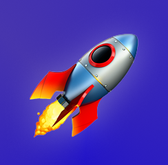

# ModelRockets.Space

A home for model rocket and space nerds 🚀👨‍🚀👩‍🚀

## Installing Locally

#### Clone the repo

```bash
git clone https://github.com/WyattCast44/modelrockets.space.git
```

#### Move into project

```bash
cd modelrockets
```

#### Copy the env file

Make sure you set your local credentials in your .env file.

```bash
cp .env .example .env
```

#### Install Composer dependencies

```bash
composer install
```

#### Install NPM dependencies (Optional)

```bash
yarn install
```

#### Run Front End Asset Build (Optional)

```bash
yarn dev
```

#### Migrate the Database 

Make sure you make created a database and update the env file

```bash
php artisan migrate --seed
```

## Background

## Core Content Models

-   Articles
-   Boards
-   Threads
-   Replies

## Front End

-   All templating is handled via Laravel Blade.
-   All front end asset compilation is handled via Laravel Mix.

### CSS

I have chosen to use [TailwindCSS](https://stimulusjs.org/) as the main CSS library for this project. I have also chosen to pull in small Bootstrap components for specific uses, such as basic form styling.

### Javascript

My goal in this project is to use JS solely for progressive enchancement. This means that the app should function completely even with javascipt disabled.

I have chosen to use [StimulusJs](https://stimulusjs.org/) for handling any JS needs. I have also installed [Turbolinks]([https://github.com/turbolinks/turbolinks), again as an enhancement, if this gets turned off the app should still work.

#### Generating Stimulus Controllers

To generate a new stimulus controller via the command line:

```bash
php artisan make:stimulus myname
```

This will create a new `myname_controller.js` in the `resources/js/controllers` directory with a basic controller stub. You can also manually create controllers and place them in the controllers folder.
